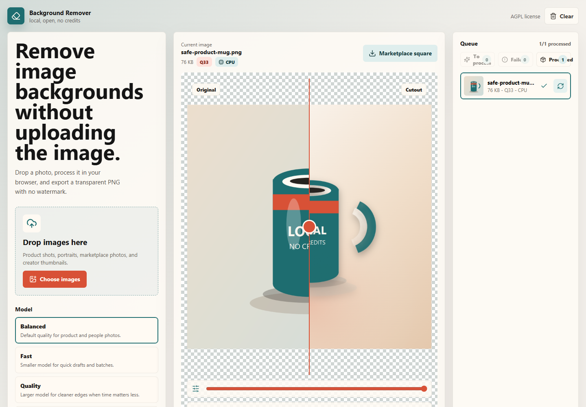

# Background Remover

[](https://github.com/Martin123132/background-remover/actions/workflows/ci.yml)

A local-first, source-available background remover for personal and non-commercial product, creator, and marketplace workflows.

[Live demo](https://martin123132.github.io/background-remover/) | [Export presets and scenes](docs/EXPORT_PRESETS.md) | [Known limitations](docs/KNOWN_LIMITATIONS.md) | [Release notes draft](docs/RELEASE_NOTES_DRAFT.md) | [Commercial licensing](COMMERCIAL-LICENSE.md)



The demo above is a real processed output generated from the repo-local fixture at `test-fixtures/safe-studio-product.png`, with marketplace composition and product shadow enabled. No private images are used.

## What it does

- Removes image backgrounds in the browser.
- Keeps source images local; there is no upload step.
- Loads a repo-safe sample image so visitors can try the app immediately.
- Exports transparent PNGs with no watermark.
- Reviews cutout edges with source/split/cutout modes, zoom-and-pan inspection, mask/edge overlays, and quick backdrop toggles.
- Adds product-photo backgrounds, marketplace export presets, shadows, and ZIP export.
- Exports completed batch items separately from pending or failed queue items.
- Handles duplicate source filenames during ZIP export by appending `-2`, `-3`, etc. to output names so entries remain unique.
- Names ZIP exports with the selected preset, composition scene, and processed image count.
- Adds a lightweight, persistent export manifest log kept in browser storage and downloadable as CSV.
- Supports quick per-run manifest downloads and settings restore from the recent-export history panel.
- Remembers export, scene, and shadow preferences across browser reloads, with a top-right reset action.
- Uses self-hosted model/WASM assets from `public/models/background-removal`.

More on presets and composition scenes is in [Export presets and scenes](docs/EXPORT_PRESETS.md).
Static hosting notes are in [Static deployment](docs/DEPLOYMENT.md).

## What it replaces

Background Remover is built for common paid-tool workflows that should not need credits or hosted uploads for personal and non-commercial use:

- Credit-based background removal tools.
- Watermarked free exports.
- Hosted-only batch background removal.
- Manual product-photo canvas, shadow, and ZIP-export cleanup.

## Queue workflow

- Add multiple files to the queue at once with the dropzone.
- Use **Process queue** to remove backgrounds from ready and failed jobs.
- Use **Retry failed** when failures remain after a batch run.
- Filter queue items by status with the filter controls:
  - All
  - Ready
  - Working
  - Done
  - Failed
- Export processed items only with **Export processed ZIP**.
- Download a persisted batch export history CSV with **Export log**.
- Restore a previous run's preset, scene, and shadow controls with **Use settings**.
- Clear export run history with **Clear export log**.
- Clear completed/failed workflow noise with **Clear processed** and **Clear failed**.
- Remove individual items from the queue with the per-item remove action.

## Requirements

- Windows PowerShell
- Node.js 18 or newer
- npm
- Git

## Quick start

For first-run setup and local development, use the PowerShell wrappers instead of calling npm directly. They keep npm, temp, and model caches under this repository:

```powershell
cd D:\open-source\background-remover
.\scripts\bootstrap.ps1
.\scripts\dev.ps1
```

Open the local app at:

```text
http://127.0.0.1:5173/
```

If Vite chooses another port because one is busy, use the URL printed in the terminal.

## Common commands

After bootstrap, these package scripts are available:

```powershell
npm.cmd run dev
npm.cmd run fixtures:generate
npm.cmd run lint
npm.cmd run build
npm.cmd run build:github-pages
npm.cmd run check
npm.cmd run check:docs-assets
npm.cmd run qa
npm.cmd run qa:live
npm.cmd run capture:demo
npm.cmd run capture:preset-gallery
npm.cmd run clean:qa-artifacts
```

`npm.cmd run check` runs lint followed by the production build. There is no separate unit-test suite yet; the browser regression check below is the current end-to-end QA path documented in [QA.md](docs/QA.md).

`npm.cmd run fixtures:generate` regenerates the safe public demo fixture at `test-fixtures/safe-studio-product.png` and the live-demo sample at `public/samples/safe-studio-product.png`.

`npm.cmd run build:github-pages` builds the static app with `/background-remover/` as the Vite base path for GitHub Pages-style hosting.

`npm.cmd run check:docs-assets` verifies the public fixture, README capture, and preset-gallery captures exist and still have their expected dimensions.

`npm.cmd run qa:live` runs the preview/export regression against the deployed GitHub Pages demo at `https://martin123132.github.io/background-remover/`.

## Storage rule

This repo is intentionally rooted on `D:\open-source\background-remover`. The PowerShell scripts set npm, temp, and model cache paths inside this repo so development artifacts do not spill onto `C:`.

Generated folders and build outputs are intentionally ignored by Git: `.cache/`, `.tmp/`, `dist/`, `outputs/`, `node_modules/`, and downloaded files under `public/models/background-removal/`.

See `docs/D_DRIVE_POLICY.md` for the full local storage policy.

## Testing

Run the preview/export regression check with:

```powershell
cd D:\open-source\background-remover
npm.cmd run qa:preview-export
```

The command starts the local Vite app on `http://127.0.0.1:5175/` when one is not already running, uploads two fixture images, applies the marketplace export preset with a product-photo background and shadow, then verifies:

- The live composed preview stays capped at `900x900` so slider changes do not repeatedly render full-size output.
- Review controls update preview zoom/pan, mask/edge overlays, fit/center reset, and dark/checker backdrop state without affecting export quality.
- The selected PNG export and ZIP exports remain full preset quality at `2000x2000`.
- Recent export history restores prior preset, scene, and shadow settings.
- Queue controls are locked while batch processing is running.

QA artifacts are written under `D:\open-source\background-remover\.tmp\qa-preview-export\`, including:

- `preview-performance-result.png`
- `safe-product-mug-marketplace-2000.png`
- `background-remover-marketplace-2000-warm-2-images.zip`

Server logs for a QA-started dev server are written to:

- `D:\open-source\background-remover\.tmp\qa-preview-export-server.log`
- `D:\open-source\background-remover\.tmp\qa-preview-export-server.err.log`

Supported overrides:

- `BACKGROUND_REMOVER_QA_URL`: run against a different local app URL.
- `BACKGROUND_REMOVER_TEST_IMAGE`: use a different local fixture image. By default QA uses `test-fixtures/safe-product-mug.png`.
- `BROWSER_EXECUTABLE_PATH`: use a different Chromium-family browser executable. This path is only used to launch the browser; QA downloads and artifacts still stay under this repo on `D:`.

Clean QA artifacts with:

```powershell
npm.cmd run clean:qa-artifacts
```

Regenerate the README screenshot with:

```powershell
npm.cmd run fixtures:generate
npm.cmd run capture:demo
```

Regenerate the preset gallery with:

```powershell
npm.cmd run fixtures:generate
npm.cmd run capture:preset-gallery
```

You can use these optional environment overrides to capture a different demo state:

```powershell
$env:BACKGROUND_REMOVER_DEMO_PRESET="Social avatar"
$env:BACKGROUND_REMOVER_DEMO_SCENE="Cool grey"
$env:BACKGROUND_REMOVER_DEMO_SHADOW="true"
$env:BACKGROUND_REMOVER_DEMO_SHADOW_STRENGTH="60"
$env:BACKGROUND_REMOVER_DEMO_SHADOW_BLUR="34"
$env:BACKGROUND_REMOVER_DEMO_SHADOW_OFFSET="24"
```

## Preset examples

The preset gallery in [Export presets and scenes](docs/EXPORT_PRESETS.md) is generated from the same safe repo fixture as the README demo with `npm.cmd run capture:preset-gallery`. It gives users a quick view of the intended outputs:

- Transparent PNG for downstream editors.
- Marketplace square for catalogue/product-card uploads.
- Listing square for high-resolution product listings.
- Storefront card for shop cards and catalogue banners.
- Social avatar for profile images.
- Video thumbnail for creator cards.

## Project layout

```text
src/                              React app and image workflow
src/lib/                          Background removal, file, and export helpers
scripts/                          D-drive-safe setup, dev, model, and QA scripts
public/models/background-removal/ Downloaded model and WASM assets, ignored except .gitkeep
public/samples/                   Repo-safe sample image used by the live demo
test-fixtures/                    Safe generated and hand-curated local fixtures
docs/assets/                      Safe public screenshots and preset captures
```

## Contributing and security

See `CONTRIBUTING.md` for setup, QA, and pull request guidance. See `SUPPORT.md` for useful issue reports. See `SECURITY.md` for vulnerability reporting and the project security goals.

See `ROADMAP.md` for planned work, `docs/KNOWN_LIMITATIONS.md` for current browser/runtime constraints, `docs/RELEASE_NOTES_DRAFT.md` for the next release draft, and `CHANGELOG.md` for release history.
See `docs/RELEASE_CHECKLIST.md` before tagging or publishing a release.

## License

PolyForm Noncommercial 1.0.0. See `LICENSE`, `NOTICE.md`, and `COMMERCIAL-LICENSE.md`.

Personal, hobby, research, educational, public-interest, and other non-commercial uses are permitted. Commercial use requires a separate written license from TWO HANDS NETWORK LTD.

For commercial licensing, collaboration, information on existing products, or other enquiries, contact Glyn via email at glyn@twohandsnetwork.co.uk.
