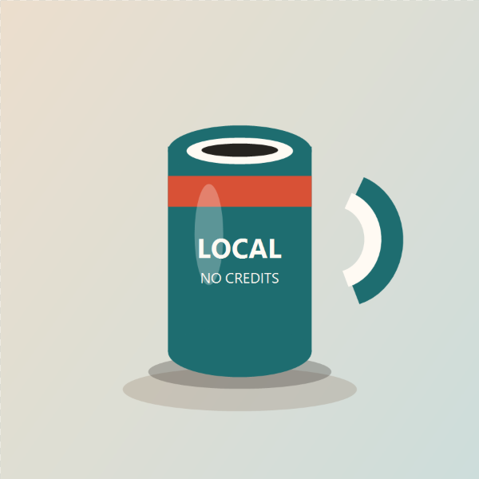
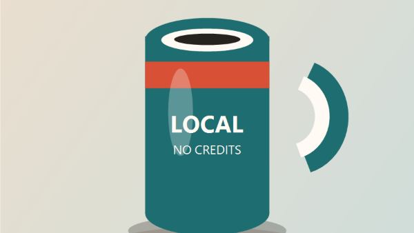

# Export Presets and Scenes

Background Remover ships with four export presets and five composition scenes so one workspace covers both cutout editing and ready-to-upload storefront outputs.

## Export presets

| Preset | Resolution | Typical use | Output suffix |
| --- | --- | --- | --- |
| Transparent PNG | Source size | Raw cutout for compositing in other design tools | `cutout` |
| Marketplace square | 2000 x 2000 | Product cards, marketplaces, and print-like catalogues | `marketplace-2000` |
| Social avatar | 1080 x 1080 | Profile and social media images | `avatar-1080` |
| Video thumbnail | 1280 x 720 | Channel thumbnails and social video cards | `thumbnail-1280x720` |

## Preset examples

These captures use the repo-local `test-fixtures/safe-product-mug.png` fixture. They are safe to publish and are not private customer images.

| Preset | Example capture | Notes |
| --- | --- | --- |
| Transparent PNG |  | Best when the next step is another editor or design tool. |
| Marketplace square |  | Uses a square product canvas for storefront uploads. |
| Social avatar |  | Keeps a profile-friendly square crop with a soft backdrop. |
| Video thumbnail |  | Uses a wide canvas suited to thumbnail layouts. |

Regenerate the full gallery with `npm.cmd run capture:preset-gallery`. Regenerate one custom capture with `npm.cmd run capture:demo` plus the documented environment overrides in the README.

## Product scenes

| Scene | Description |
| --- | --- |
| Cutout | Transparent background |
| Studio white | High-contrast white backdrop |
| Warm sweep | Soft warm gradient backdrop |
| Cool grey | Neutral gradient backdrop for tech products |
| Graphite | Dark premium tabletop look |

## Shadow controls

Product shadows can be enabled for non-transparent scenes only.

- Product shadow toggle turns shadow rendering on or off.
- Shadow strength controls opacity depth.
- Blur controls softness of the shadow edge.
- Offset controls vertical placement.

## Export naming

- Single image export uses: `<original-name>-<preset-suffix>.png`
- ZIP export uses: `background-remover-<preset>-<size>-<scene>-<n>-images.zip`
- ZIP export includes only items with completed outputs.
- Recent export history can restore a previous run's preset, scene, and shadow settings with **Use settings**.
